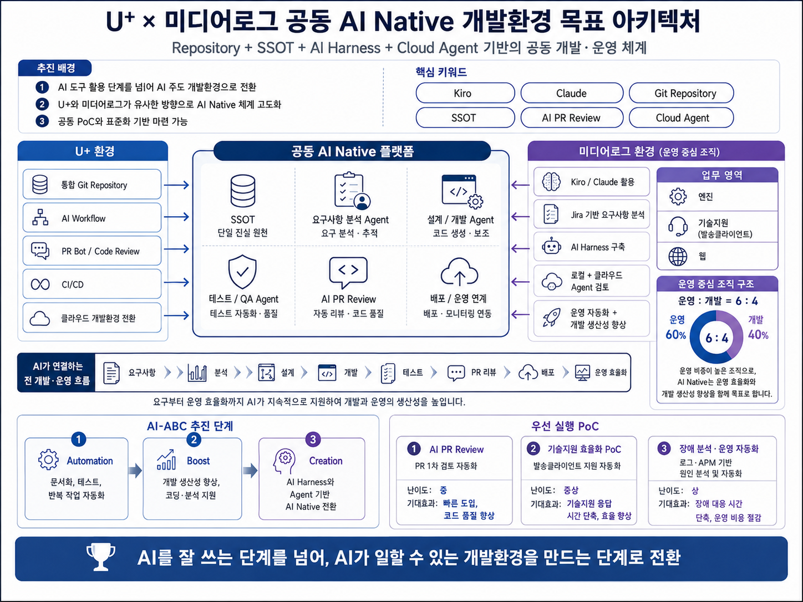

# Enterprise Messaging AI Harness

`msg-ai-work/abc`는 AX채널개발팀 기업메시징 업무의 **Common AI Harness / Control Plane** 저장소입니다.

단순히 AI에게 코드를 작성시키는 것이 아니라 요구사항 분석부터 설계, 구현, 테스트, 리뷰, 배포 준비, 운영 대응까지의 업무 방식을 **Agent + Workflow + Rule + Guardrail + Human Gate**로 표준화하고, 실제 업무 지식은 Domain Repository의 Skill로 관리하는 것을 목표로 합니다.

> **AI를 잘 쓰는 단계를 넘어, AI가 일할 수 있는 환경을 만든다.**

<p align="center">
  
</p>

---

## 1. 운영 모델

기업메시징 AI Harness는 **Hub & Spoke Multi-Repository** 구조로 운영합니다.

```text
                         msg-ai-work/abc
                     COMMON AI HARNESS / HUB
                         [리더 관리]
                              │
          Agent / Workflow / Rule / Guardrail / Template
                              │
        ┌─────────────────────┼─────────────────────┐
        │                     │                     │
        ▼                     ▼                     ▼
   abc-engine              abc-web          abc-tech-support
      Engine                 Web             Tech Support
   [담당자 관리]          [담당자 관리]          [담당자 관리]
        │                     │                     │
        └─────────────────────┼─────────────────────┘
                              │
                              ▼
                         abc-projects
                     Project / SI / PoC
                       [담당자 관리]
                              │
                              ▼
                         Domain Skills
                              │
                              ▼
                    Kiro / Cursor / Codex
```

핵심 원칙은 간단합니다.

> **리더는 AI가 일하는 방법을 관리하고, 담당자는 AI가 알아야 할 업무 지식을 관리하며, Reviewer는 변경의 품질과 안전성을 검증한다.**

---

## 2. Repository 역할

| Repository | 역할 | 주요 관리 주체 | 주요 자산 |
|---|---|---|---|
| **`msg-ai-work/abc`** | Common Harness / Control Plane | 리더 | Agent, Workflow, Rule, Guardrail, Template, Governance |
| **`msg-ai-work/abc-engine`** | Engine Domain | 엔진 담당자 | SMS/MMS/RCS GW, Kafka, TPS, 장애·배포 Skill |
| **`msg-ai-work/abc-web`** | Web Domain | 웹 담당자 | FE/BE/API/Auth/DB, 웹 운영·개발 Skill |
| **`msg-ai-work/abc-tech-support`** | Technical Support Domain | 기술지원 담당자 | 발송 Client 설치·연동·로그·장애 Skill |
| **`msg-ai-work/abc-projects`** | Project Domain | 프로젝트 담당자 | 구축, Migration, PoC, Cutover, 운영이관 Skill |

### 무엇을 어디에 넣는가

| 판단 기준 | 저장 위치 |
|---|---|
| 2개 이상 Domain에서 반복 사용하는 업무 방식 | `abc` |
| AI Agent, Workflow, 보안·품질 Rule | `abc` |
| Engine 고유 판단/운영 절차 | `abc-engine` |
| Web 고유 판단/운영 절차 | `abc-web` |
| 발송클라이언트/기술지원 고유 절차 | `abc-tech-support` |
| 특정 구축·Migration·PoC 절차 | `abc-projects` |
| Secret, 비밀번호, 운영 Credential, 개인정보 원문 | **어떤 Repository에도 저장 금지** |

---

## 3. Common Harness가 관리하는 것

`abc`는 AI가 **어떻게 일해야 하는가**를 정의합니다.

### Agent

- Requirement Analyst
- Architect
- Developer
- Tester
- Reviewer
- Release Manager

### Workflow

- Feature
- Bugfix
- Incident
- Release
- Operation

### Rule / Guardrail

- 보안 및 개인정보 보호
- Production 접근 제한
- 코드 품질
- 테스트 기준
- Git / PR 운영 기준
- Human Gate

Domain Repository는 이러한 공통 규칙을 복사해서 별도 관리하지 않습니다.

---

## 4. Domain Repository가 관리하는 것

Domain Repository는 AI가 해당 업무에서 **무엇을 알아야 하는가**를 관리합니다.

기본 구조는 다음과 같습니다.

```text
abc-<domain>/
├── README.md
├── DOMAIN.md
├── harness.yaml
├── skills/
├── knowledge/
├── runbooks/
├── evals/
└── .github/
```

| 디렉터리 | 목적 |
|---|---|
| `skills/` | AI가 재사용할 실제 판단·실행 절차 |
| `knowledge/` | 아키텍처, 규격, 용어, 환경 등 안정적인 지식 |
| `runbooks/` | 장애·배포·정기점검 등 반복 실행 절차 |
| `evals/` | Skill이 기대한 판단을 하는지 검증하는 Case |

---

## 5. Common Harness 참조 방식

각 Domain Repository의 `harness.yaml`은 이 Repository를 Common Harness로 참조합니다.

```yaml
harness:
  repository: https://github.com/msg-ai-work/abc.git
  ref: main
  mount: .ai-harness/common
  update_policy: manual-pr
```

초기 안정화 기간에는 `main`을 사용하고, 이후에는 다음처럼 Version을 고정합니다.

```yaml
ref: v1.0.0
```

### 원칙

- `abc` 파일을 Domain Repo에 수동 복사하지 않습니다.
- Domain Repo가 공통 Rule을 독자적으로 수정하지 않습니다.
- Common Harness Version 변경은 PR로 관리합니다.
- 향후 `v1.0.0`, `v1.1.0` 형태의 Semantic Version을 사용합니다.

---

## 6. 리더 / 담당자 / Reviewer 역할

| 구분 | 리더 | 담당자 | Reviewer |
|---|---|---|---|
| Harness Architecture | 설계·최종 기준 관리 | 의견·업무 적용 | 구조·일관성 검토 |
| Agent | 공통 Agent 관리 | 활용·개선 제안 | 변경 영향 검토 |
| Workflow | 공통 Workflow 관리 | 업무 적용·개선 제안 | 흐름·예외 케이스 검토 |
| Rule / Guardrail | 최종 기준 관리 | 준수·변경 제안 | 보안·품질·운영 영향 검증 |
| Domain Skill | 구조·품질 기준 관리 | **작성·개선 책임** | **내용·재사용성 검토** |
| Runbook / Knowledge | 관리 기준 제시 | **작성·최신화 책임** | **운영 적합성 검토** |
| Eval | 공통 검증 기준 관리 | Domain Case 작성 | 결과·기준 충족 여부 검증 |
| Production | Human Gate 및 승인 체계 관리 | 검증 증적 제공 | 변경·위험 검토 |

리더가 모든 Skill을 직접 작성하는 구조가 아닙니다. 실제 업무를 가장 잘 아는 담당자가 경험을 Skill로 정리하고, Reviewer가 변경의 품질과 안전성을 검증한 뒤 PR을 통해 팀 자산으로 축적합니다.

### 역할 정의 원칙

- **리더**: Common Harness, Governance, Rule/Guardrail과 중요한 의사결정의 책임 주체
- **담당자**: 각 Domain의 Skill, Knowledge, Runbook을 작성하고 최신 상태로 유지하는 실행 주체
- **Reviewer**: 담당자가 만든 변경을 독립적으로 검토하여 기술·품질·보안·운영 기준 충족 여부를 확인하는 검증 주체

---

## 7. AI가 수행하는 개발·운영 흐름

```text
요구사항 / 장애 / 운영작업
          ↓
    Common Workflow 선택
          ↓
      Domain 식별
          ↓
 Common Agent + Domain Skill
          ↓
      분석 / 구현
          ↓
       Test / Eval
          ↓
      AI PR Review
          ↓
      Human Review
          ↓
       main Merge
          ↓
  배포 / 운영 Human Gate
          ↓
 경험을 Skill/Runbook으로 환류
```

AI는 분석과 실행을 지원하지만 **Production 배포, 운영 데이터 변경, 위험 수용, Merge의 최종 승인 책임을 대신하지 않습니다.**

---

## 8. Skill 작성 기준

Skill은 단순 설명 문서가 아니라 **AI가 일정한 순서로 판단하고 실행할 수 있도록 만드는 업무 절차**입니다.

각 Skill은 최소 다음 항목을 포함합니다.

1. 적용 범위
2. 필요한 입력
3. 판단 순서
4. 체크리스트 또는 실행 절차
5. 정상/비정상 판단 기준
6. 산출물
7. 금지사항 / Guardrail
8. Human Gate
9. Evaluation Case

### 좋은 Skill

- 실제 반복 업무에 바로 사용할 수 있음
- 담당자의 기억에만 의존하지 않음
- 신규 인력도 같은 순서로 판단 가능
- 장애·개발 경험이 쌓일수록 PR로 개선됨
- AI와 사람이 담당할 경계가 명확함

---

## 9. Skill Lifecycle

```text
실제 업무 / 장애
      ↓
원인 및 해결
      ↓
재사용 가능한 판단 절차로 일반화
      ↓
Domain Skill / Runbook 수정
      ↓
skill/<topic> Branch
      ↓
Pull Request
      ↓
Reviewer Review
      ↓
Eval
      ↓
main Merge
      ↓
다음 업무부터 AI가 재사용
```

Skill도 Source Code와 동일하게 **담당자, Reviewer, Version, Evaluation**을 갖는 팀 자산으로 관리합니다.

---

## 10. 운영 우선순위

기업메시징 업무 특성을 고려하여 운영 자동화를 우선합니다.

| 구분 | 기준 | 우선 영역 |
|---|---:|---|
| **운영** | **60%** | 장애 진단, 반복 점검, 기술지원, 배포 검증, 고객 문의 |
| **개발** | **40%** | 영향도 분석, 구현, Test, PR Review, 품질 개선 |

AI Harness의 성공 기준은 코드 생성량이 아니라 **사람이 반복적으로 하던 판단과 작업이 얼마나 줄었는가**입니다.

---

## 11. Human Gate

AI가 독단적으로 수행하지 않는 작업입니다.

- Production 배포 승인
- 운영 서버 재기동
- 운영 DB/Data 임의 변경
- 메시지 재처리 및 트래픽 전환
- 보안 예외 승인
- 위험 수용 결정
- 보호 Branch Merge 승인

**AI executes, humans decide.**

---

## 12. 기존 Domain Skill Migration

기존 `abc/.kiro/skills/domains/`에 있던 Domain Skill은 Multi-Repository 전환 과정에서 아래 Repository로 이관합니다.

| 기존 위치 | 신규 SSOT |
|---|---|
| `.kiro/skills/domains/engine/` | `msg-ai-work/abc-engine/skills/domain-core/` |
| `.kiro/skills/domains/web/` | `msg-ai-work/abc-web/skills/domain-core/` |
| `.kiro/skills/domains/tech-support-client/` | `msg-ai-work/abc-tech-support/skills/domain-core/` |

기존 경로는 전환 기간 동안 Migration 안내용으로 유지한 후, Domain Repository가 안정화되면 제거하거나 Deprecated Stub으로 전환합니다.

---

## 13. AI-ABC와의 연결

```text
Automation
   ↓
반복 운영·개발 업무 자동화

Boost
   ↓
Domain Skill을 통한 담당자 생산성 향상

Creation
   ↓
Agent + Harness 기반의 새로운 업무 방식 창출
```

이 Multi-Repository AI Harness는 **Automation → Boost → Creation**을 실제 업무에서 실행하기 위한 기반입니다.

---

## 14. 목표

> 개인의 경험을 Domain Skill로 만들고,
> Git을 SSOT로 사용하며,
> 공통 Harness와 업무 지식을 분리해 관리하고,
> AI가 이를 반복적으로 재사용하게 하며,
> 사람은 중요한 판단과 승인에 집중한다.

**AI를 사용하는 팀에서 AI가 일할 수 있는 팀으로 전환합니다.**
