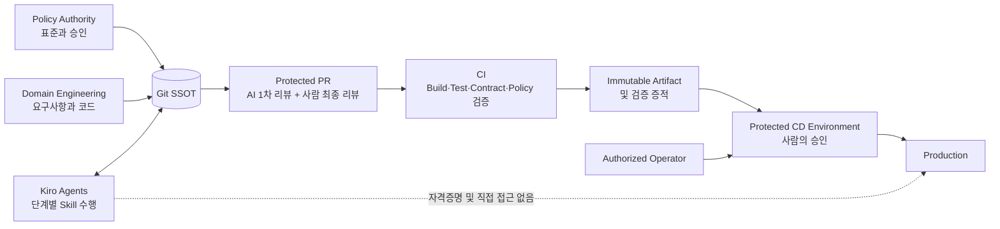

# AI Harness 시스템 컨텍스트

## 목적

AI Harness는 AI에 운영 환경 직접 접근 권한을 부여하지 않으면서 Policy Authority, Domain Engineering, Kiro Agent, Git/PR, CI, 보호된 Release Operation을 하나의 통제된 흐름으로 연결한다.

## 신뢰 경계

- Kiro Agent는 Checkout된 Workspace와 명시적으로 Load된 저장소 Resource 범위에서 동작한다.
- 선언되지 않은 외부 데이터 경로 사용을 방지하기 위해 Agent Profile은 기본적으로 Workspace MCP와 설치된 Powers를 제외한다.
- CI는 읽기/테스트 수준의 권한과 비운영 환경 Dependency만 사용한다.
- Protected Branch와 Protected Environment를 통해 사람의 승인과 역할 분리를 강제한다.
- 운영 자격증명은 승인된 CD Platform 또는 Operator에 의해서만 해석되며 Git이나 Agent Context에 포함되지 않는다.

## 문서 계약 체인

`REQUIREMENT.md` → `impact-analysis.md` + `implementation-plan.md` → 코드/증적 → `test-report.md` → `review-report.md` → `release-record.md`

각 화살표는 Git에 저장된 문서를 통한 업무 인계를 의미한다. 요구사항, 계획, PR, 배포 Gate에는 사람의 승인 증적이 필요하다. 대화 기록은 참고 컨텍스트일 뿐 지속 가능한 승인 근거나 SSOT가 아니다.
