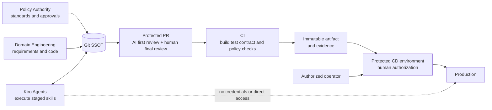

# AI Harness System Context

## Purpose

The harness connects policy authority, domain delivery, Kiro Agents, Git/PR, CI, and protected release operations without granting AI production access.

## Trust boundaries

- Kiro Agents operate on the checked-out workspace and explicitly loaded repository resources.
- Agent profiles exclude workspace MCP and installed Powers by default to avoid undeclared external data paths.
- CI uses read/test permissions and non-production dependencies.
- Protected branches and environments enforce human approvals and separation of duties.
- Production credentials are resolved only by the approved CD platform/operator and never enter Git or Agent context.

## Contract chain

`REQUIREMENT.md` → `impact-analysis.md` + `implementation-plan.md` → code/evidence → `test-report.md` → `review-report.md` → `release-record.md`.

Every arrow is a file-backed handoff. Requirement, plan, PR, and deployment gates require human evidence. Conversation history is convenient context, not durable authority.
